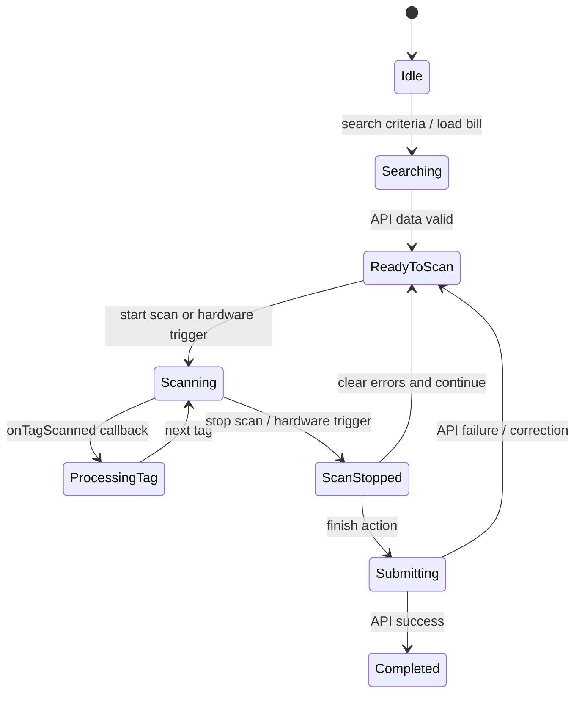

# 📊 System Architecture Documentation

## 0. Major Modules Identified (Code-Reverse-Engineered)

### Flutter feature modules
- `splash`
- `login`
- `main` (nested tabs: `home`, `phom`, `shelf`, `lend`, `user`)
- `bindingPhom`
- `updatebinding`
- `lendGive`
- `lendReturn`
- `transfer_lend`
- `lendRegister`
- `lendAll`
- `lendDetails`
- `informationUser`
- `languageSetting`
- `changePassword`
- `forgotPassword`

### Flutter shared/core modules
- Routing: `core/routes/pages.dart`, `core/routes/routes.dart`
- State + DI framework: GetX (`GetMaterialApp`, `GetxController`, `Bindings`, `Obx`)
- Native bridge service: `core/services/rfid_service.dart`
- API client: `core/services/dio.api.service.dart`
- Legacy/unused API client in current flows: `core/services/api.service.dart`
- Local preferences wrapper: `core/data/pref/prefs.dart`
- User use cases + models: `core/services/models/user/...`
- Domain models used in payloads/UI: `phom_model.dart`, `lend_model.dart`, `size_infor_model.dart`

### Android native modules
- `MainActivity.kt` (Flutter bridge + hardware key forwarding)
- `RFIDHandler.kt` (RFID SDK integration and callbacks)
- `Reader.kt` (SDK holder around `ReaderHelp`)
- Native SDK artifact: `android/app/libs/rfiddrive-release.aar`

---

## 1. Project Overview

This application is an RFID-enabled Flutter system for managing phom lifecycle operations (binding, updating binding, lending out, returning, and transfer between departments).

From code behavior:
- Flutter provides the operational UI, feature flows, and business orchestration.
- Android native code integrates a vendor RFID SDK (`com.rfid.trans.*`) and exposes it to Flutter over a `MethodChannel`.
- Backend integration is HTTP-based (Dio), mostly under `/phom/*` and `/auth/login` endpoints.
- Local persistence is lightweight and preference-based (user profile/token/language in `SharedPreferences`), not relational table storage.

---

## 2. Project Structure

### Flutter Layer

- `lib/main.dart`:
  - App bootstrap (`appConfig`, dotenv load, run app).
- `lib/app.dart`:
  - Root `GetMaterialApp`, route table hookup, translations, locale restore.
- `lib/core/`:
  - `routes/`: central route names + page bindings.
  - `services/`: RFID bridge, Dio API service, websocket helper, image helper.
  - `data/pref/`: shared preference abstraction.
  - `services/models/`: user/phom/lend model types and use cases.
  - `ui/`: reusable widgets/dialogs/snackbar.
- `lib/features/`:
  - Feature-based organization, each feature typically split into:
    - `presentation/page`
    - `presentation/controller` (`GetxController`)
    - `di` (`Bindings` for GetX dependency injection)

### Android Native Layer

- `android/app/src/main/kotlin/com/example/lhg_phom/MainActivity.kt`:
  - Defines `MethodChannel("rfid_channel")`.
  - Handles Flutter -> Android method calls (`connectRFID`, `scanRFID`, `stopScan`, etc.).
  - Captures hardware key code `523` and sends event `onScanButtonPressed` back to Flutter.

- `android/app/src/main/kotlin/com/example/lhg_phom/RFIDHandler.kt`:
  - Wraps RFID SDK operations (`Connect`, `StartRead`, `ScanRfid`, `StopRead`, `DisConnect`).
  - Registers `TagCallback` and pushes scan events to Flutter (`onTagScanned`).
  - De-duplicates EPCs at native side via `mutableSetOf<String>()`.

- `android/app/src/main/kotlin/com/example/lhg_phom/Reader.kt`:
  - Singleton holder for `ReaderHelp` instance.

- `android/app/build.gradle.kts`:
  - Loads `libs/rfiddrive-release.aar`.
  - `jniLibs.srcDirs("libs")`.

---

## 3. High Level Architecture

```text
┌───────────────────────────────────────────────────────────────┐
│ Flutter Presentation Layer                                   │
│ GetX Pages + Controllers (login, binding, lend, return, ...) │
└───────────────────────────┬───────────────────────────────────┘
                            │
                            │ Calls RFIDService + ApiService
                            │
┌───────────────────────────▼───────────────────────────────────┐
│ Flutter Service Layer                                         │
│ - RFIDService (MethodChannel: rfid_channel)                  │
│ - ApiService (Dio)                                            │
│ - Prefs (SharedPreferences wrapper)                           │
└───────────────┬──────────────────────────────┬────────────────┘
                │                              │
                │ MethodChannel                │ HTTP(S)
                │                              │
┌───────────────▼──────────────────┐   ┌──────▼──────────────────────────────┐
│ Android Native Layer             │   │ Backend APIs                         │
│ MainActivity + RFIDHandler       │   │ /auth/login, /phom/*                │
│ RFID SDK (rfiddrive-release.aar) │   │ validation/binding/lend/return ops  │
└───────────────┬──────────────────┘   └─────────────────────────────────────┘
                │
                │ SDK calls
                │
┌───────────────▼──────────────────┐
│ RFID Reader Hardware             │
└──────────────────────────────────┘

┌──────────────────────────────────┐
│ Local Persistence                │
│ SharedPreferences (language/user)│
└──────────────────────────────────┘
```

---

## 4. RFID Scanning Flow

### Continuous scan flow (implemented in multiple controllers)

```text
User
 | presses scan button (UI or hardware key)
 v
Flutter Screen/Page
 | calls controller.toggle/start
 v
Flutter Controller (e.g. BindingPhomController)
 | RFIDService.connect()
 | RFIDService.clearScannedTags()
 | RFIDService.scanContinuous(callback)
 v
RFIDService (Flutter)
 | invokeMethod("connectRFID" / "scanRFID")
 v
MethodChannel("rfid_channel")
 v
MainActivity -> RFIDHandler (Android)
 | Reader.rrlib.StartRead() / ScanRfid()
 v
RFID Reader Hardware + SDK callback
 | tagCallback(ReadTag)
 v
RFIDHandler
 | native dedupe (scannedEPCs set)
 | invokeMethod("onTagScanned", {epc,rssi,antId})
 v
RFIDService.setMethodCallHandler
 | forwards EPC/data to controller callback
 v
Flutter Controller
 | validates against API/business rules
 | updates observable state (lists/counters/errors)
 | optionally submit finalized payload to API
```

### Hardware trigger flow

```text
User presses hardware key (keyCode 523)
 -> MainActivity.onKeyDown
 -> MethodChannel.invokeMethod("onScanButtonPressed")
 -> RFIDService handler
 -> registered Flutter callback (setOnHardwareScan)
 -> feature controller toggles scan start/stop
```

---

## 5. Flutter ↔ Android Communication

### Channel type used
- `MethodChannel` only.
- No `EventChannel` found.
- No `BasicMessageChannel` found.

### Channel name
- `rfid_channel`

### Flutter -> Android methods
- `connectRFID`
- `scanRFID` with args `{ mode: 0 | 1 }`
- `startScan` (mapped to continuous read)
- `stopScan`
- `clearScannedTags`
- `disconnectRFID`

### Android -> Flutter callbacks/events
- `onConnected`
- `onError`
- `onTagScanned` (payload includes `epc`, `rssi`, `antId`)
- `onContinuousScanStart`
- `onScanStopped`
- `onScanButtonPressed` (hardware key relay)

### Integration style
- Bidirectional method invocation over one channel.
- Flutter registers a single handler and routes callback methods to feature controllers via `RFIDService` callbacks.

---

## 6. Data Flow

### Authentication flow

```text
LoginPage -> LoginController.login()
 -> POST /auth/login
 -> UserModel.fromJson(response.data['data'])
 -> SaveUserUseCase.userSave(user) -> Prefs.set(user)
 -> Navigate to main route
```

### Binding phom flow (example)

```text
Search criteria (matNo/name/size)
 -> POST /phom/searchPhomBinding
 -> Controller sets isScan=true and inventory rows

Start RFID scan
 -> collect unique tags + construct PhomBindingItem list

Stop scan
 -> POST /phom/checkExitsRFID (validate tag existence/errors)

Finish
 -> POST /phom/bindingPhom with details[]
 -> show summary (success/failure RFIDs)
```

### Lend give flow (example)

```text
Search bill
 -> POST /phom/layphieumuon (must be confirmed)
 -> build expected inventoryDataMap

Scan tags continuously
 -> for each EPC: POST /phom/getphomrfid
 -> classify: valid / mismatched / excess / already lent / invalid
 -> update left/right/pairs counters

Finish
 -> POST /phom/saveBill with valid scannedRfidDetailsList
```

### Return flow (example)

```text
Load departments
 -> POST /phom/getDepartment

Scan EPC
 -> POST /phom/checkRFIDinBrBill
 -> classify as returnable vs returned vs unborrowed

Finish
 -> POST /phom/submitReturnPhom with RFID_LIST
```

### Transfer flow (example)

```text
Search bill
 -> POST /phom/layphieumuon

Resolve scanned EPC to item
 -> POST /phom/getphomrfid
 -> increment scanned count per row

Finish transfer
 -> POST /phom/submitTransfer with BILL_RETURN + BILL_BORROW payloads
```

### API endpoint inventory found in code
- `/auth/login`
- `/phom/getInforPhomBinding`
- `/phom/checkExitsRFID`
- `/phom/getPhomByLastMatNo`
- `/phom/getSizeNotBinding`
- `/phom/searchPhomBinding`
- `/phom/bindingPhom`
- `/phom/getPhomNotBinding`
- `/phom/updatephom`
- `/phom/layphieumuon`
- `/phom/getphomrfid`
- `/phom/saveBill`
- `/phom/getDepartment`
- `/phom/checkRFIDinBrBill`
- `/phom/submitReturnPhom`
- `/phom/submitTransfer`

---

## 7. Database Schema

### Local database findings
- No app-level SQLite schema definitions found in Flutter source.
- No `openDatabase`, `CREATE TABLE`, DAO/entity model, Room, Hive, Isar, or Drift usage in project Dart code.
- Persistence used in active code path: `SharedPreferences` key-value storage.

### Effective local storage schema (SharedPreferences)

```text
┌──────────────────────────────────────────────┐
│ SharedPreferences                            │
├──────────────────────────────────────────────┤
│ languageCode | String                        │
│ user         | JSON string(UserModel)        │
│ auth         | JSON string(Authentication)    │
└──────────────────────────────────────────────┘
```

### Runtime in-memory data tables (controller-managed)

These are not persisted DB tables, but are central to business logic:

```text
┌──────────────────────────────────────────────────────────────┐
│ inventoryData (LendGive/Transfer/Binding flows)             │
├──────────────────────────────────────────────────────────────┤
│ LastName | LastSize | Expected | Left | Right | Diff | Scan │
└──────────────────────────────────────────────────────────────┘
```

```text
┌──────────────────────────────────────────────────────────────┐
│ scannedRfidDetailsList                                       │
├──────────────────────────────────────────────────────────────┤
│ RFID | LastMatNo | DepID | ScanDate | (ID_BILL/User fields) │
└──────────────────────────────────────────────────────────────┘
```

---

## 8. State Management

State management is GetX-centric:
- `GetMaterialApp` for routing/app shell.
- `GetxController` per feature.
- Reactive state through `.obs` (`RxString`, `RxBool`, `RxList`, etc.).
- UI updates via `Obx` and occasional `GetBuilder`.
- Dependency injection via per-feature `Bindings` and `Get.lazyPut(...)`.

No Bloc/Provider/Riverpod architecture found.

### Scan state machine (common pattern across RFID features)



---

## 9. Background Processing

No explicit background execution framework found:
- No WorkManager usage.
- No Android foreground/background service implementation for task scheduling.
- No Dart isolate/compute-based background workers found for sync.

Observed async behavior is foreground-driven:
- Timer/debounce in controllers.
- Async HTTP calls.
- Stream-like RFID callbacks through `MethodChannel` handler.

---

## 10. Error Handling

### RFID connectivity and runtime errors
- Native side emits `onError` for connection/start-read failures.
- Flutter `RFIDService.connect()` returns `false` on exception/failed call.
- Controllers gate scan start on successful `connect()` and print/show feedback on failure.

### Duplicate / invalid tag handling
- Native: duplicate EPC suppression in `RFIDHandler.scannedEPCs`.
- Flutter: additional dedupe sets/lists in controllers.
- Feature-level classification in lend flows:
  - invalid/not found,
  - mismatched to expected bill,
  - excess over expected pairs,
  - already-lent scenarios.

### API failures and retries
- `dio.api.service.dart` includes retry interceptor (timeouts + 503/504).
- Controllers still perform local status checks (`statusCode`, payload status fields) and show warnings/errors.
- Some flows continue with partial success and show summary dialogs.

### Network offline / server unavailable behavior
- No dedicated offline queue or sync replay mechanism found.
- Failures are handled immediately in controller UI feedback (`Get.snackbar`, dialogs, logs).

### Invalid input handling
- Login validates empty user/password/factory before API call.
- RFID workflows enforce prerequisites (e.g., search/bill selection before scanning, stop scan before finish).
- Finish actions typically block when no valid scanned data exists.

---

## 11. Architecture Pattern Determination

Based on code evidence, the architecture is:

1. Feature-based modular structure.
2. GetX MVC-like presentation architecture:
   - Page (View) + GetxController (state/logic) + Binding (DI).
3. Service layer pattern:
   - Shared services (`RFIDService`, `ApiService`, `Prefs`) used directly by controllers.
4. Partial use-case abstraction for user/session persistence:
   - `GetuserUseCase`, `SaveUserUseCase`.

Not clearly present as full patterns:
- Full Clean Architecture layering (strict domain/data separation) is partial only.
- Repository pattern is not explicitly implemented in current code (no repository classes in active flows).
- MVVM naming is not used; behavior aligns more with GetX controller-driven MVC/MVVM hybrid style.
